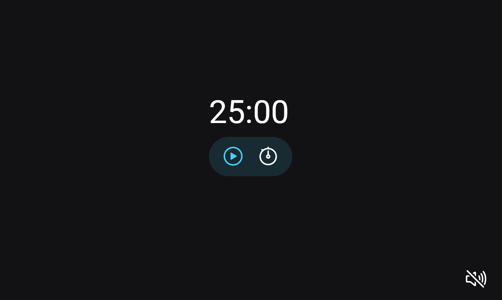

# Temporizador (Em progresso)
 

> Explorer Stage 5

Projeto feito utilizando os conceitos de HTML, CSS e JavaScript para criar um Temporizador com música através do curso da RocketSeat "Explorer".

## [🔗 Clique aqui para acessar o projeto](https://loren175.github.io/focus-timer)

#

## 📕 Layout
- Você pode visualizar o projeto do Figma através [desse link.](https://www.figma.com/file/vCgr3hLFP2vadNAwlg04VM/Explorer-Stage-05-Projeto-01-(Copy)?node-id=0%3A1&t=lO4kh69yVyFPxpWs-0)

## 🚀 Tecnologias

- HTML
- CSS
- JavaScript
- Git e Github

## 📞 Contato

>rafael.loren175@gmail.com

>+55 (11) 99959-9140

## 👾 Discord

>rafas#7622